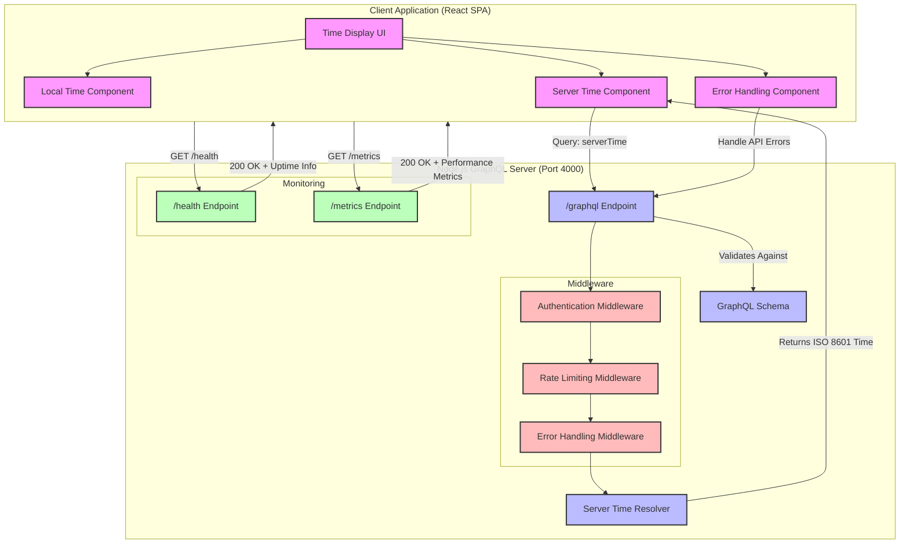

## Gherkin challenges upfront



### Type Inference and Preservation Analysis
#### Type Inference Process
Generic Type (T):

Gherkin Representation: Used the Background section to establish that a generic type exists
Inference Back: The generic type parameter <T> was preserved through explicit mention in the table
Array Type (items: T[]):

Gherkin Representation: Described as "Array<T>" in the table
Inference Back: The array type was inferred from both the type column ("Array<T>") and the description
Numeric Types (total, page, pageSize):

Gherkin Representation: Described as "Number" in the table
Inference Back: These were correctly inferred as number types in TypeScript
Boolean Type (hasMore):

Gherkin Representation: Described as "Boolean" in the table
Inference Back: This was correctly inferred as a boolean type
Information Preservation Challenges
Type 

#### Constraints:

Not Preserved: TypeScript can specify constraints on generics (e.g., <T extends BaseEntity>), but this cannot be fully expressed in Gherkin's natural language format
Optional Properties:

Not Applicable Here: The original interface didn't have optional properties, but if it did (using ?), this would be difficult to express precisely in Gherkin
Union Types:

Not Applicable Here: The original interface didn't have union types, but representing complex types like string | number would require verbose descriptions in Gherkin
Default Values:

Not Preserved: TypeScript can specify default values for interface properties in implementations, which isn't captured in the interface definition or the Gherkin
Documentation:

Enhanced: The Gherkin format actually adds more context through its scenario descriptions and purpose statements that aren't present in the TypeScript interface
The Gherkin representation successfully captures the structural information and basic types while adding behavioral context, but it cannot fully represent more advanced TypeScript type features like conditional types or mapped types.


## Gherkin examples using typescript sources
```prompt
I'm working on translating between TypeScript interfaces and Gherkin scenarios while preserving type information. Please help me with this two-way conversion:

1. First, convert this TypeScript interface to a Gherkin feature/scenario that captures the structural and type information:

[PASTE TYPESCRIPT CODE HERE]

2. Then, show me how to convert the Gherkin back to TypeScript while preserving as much type information as possible. Demonstrate how to infer specific types (numbers, booleans, arrays, generics) from the natural language descriptions in the Gherkin.

3. Explain your reasoning for each type inference and identify any information that cannot be fully preserved in the conversion process.

Please focus on maintaining maximum fidelity between the two formats, recognizing that Gherkin is behavior-focused while TypeScript is structure-focused.

```

### Pagination
```ts
// Base pagination type
interface PaginatedResponse<T> {
  items: T[];
  total: number;
  page: number;
  pageSize: number;
  hasMore: boolean;
}
```
Initial attempt:
```gherkin
Feature: Paginated Response Structure

  Scenario: Handling a paginated response
    Given a collection of items of type T
    And a total count of all available items
    And the current page number
    And the page size
    And information about whether more items exist
    Then the response should contain all these properties
    And the items should be accessible as an array

```

Refined pass:
```gherkin
Feature: Paginated Response Structure
  As a developer
  I want to work with paginated data responses
  So that I can efficiently handle large datasets

  Background:
    Given a generic type T exists for the response items

  Scenario: Retrieving a paginated response
    When I request a paginated collection of type T
    Then I should receive a response with the following structure:
      | Field    | Type      | Description                                  |
      | items    | Array<T>  | Collection of items of type T                |
      | total    | Number    | Total count of all available items           |
      | page     | Number    | Current page number                          |
      | pageSize | Number    | Number of items per page                     |
      | hasMore  | Boolean   | Flag indicating if more pages are available  |

  Scenario Outline: Validating pagination properties
    Given a paginated response of type T
    When I check the "<property>" property
    Then it should be of type "<type>"

    Examples:
      | property | type    |
      | items    | Array   |
      | total    | Number  |
      | page     | Number  |
      | pageSize | Number  |
      | hasMore  | Boolean |

```

### Search Params
```ts
// Request params
interface SearchParams {
  query: string;
  page?: number;
  limit?: number;
  sort?: 'asc' | 'desc';
}
```

```gherkin
Feature: Search Parameters

  Scenario: Basic search with required parameters
    Given a search query string
    Then the search can be performed

  Scenario: Search with optional pagination
    Given a search query string
    And an optional page number
    And an optional limit of results
    Then the search returns the specified page with the specified limit

  Scenario: Search with sorting
    Given a search query string
    And an optional sort direction of either "asc" or "desc"
    Then the search results are sorted accordingly

```

### API Error
```ts
// API error
interface ApiError {
  code: string;
  message: string;
  details?: Record<string, unknown>;
}
```

```gherkin
Feature: API Error Handling

  Scenario: Handling a basic API error
    Given an error code string
    And an error message string
    Then the error can be properly identified and communicated

  Scenario: Handling an API error with details
    Given an error code string
    And an error message string
    And optional additional details as key-value pairs
    Then the error can be properly identified with contextual information

```
### API Function
```ts
// Combine them
async function searchApi<T>(
  params: SearchParams
): Promise<PaginatedResponse<T> | ApiError> {
  // Implementation
}
```

```gherkin
Feature: Search API Function

  Scenario: Successful search request
    Given valid search parameters
    When the search API is called
    Then it returns a paginated response of items

  Scenario: Failed search request
    Given invalid or problematic search parameters
    When the search API is called
    Then it returns an API error with appropriate code and message

```